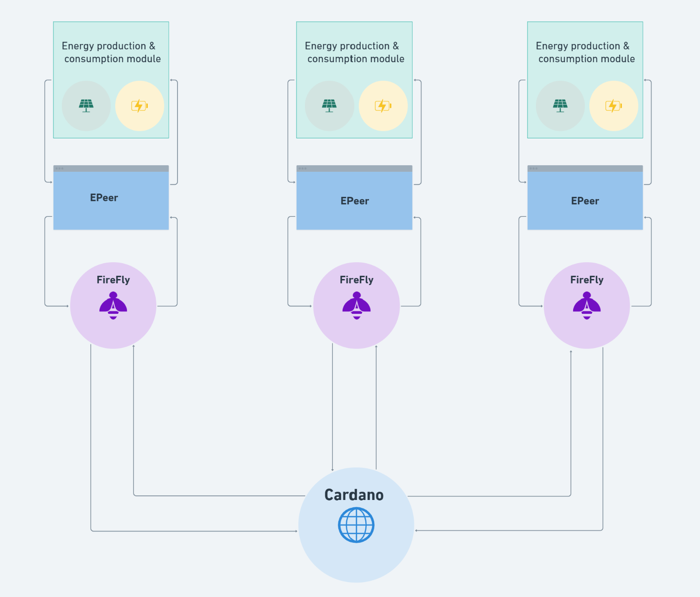

# Project Title: epeer – Decentralized Energy Exchange on FireFly and Cardano

## Project Description

**epeer** is an innovative decentralized energy trading platform built on top of the **FireFly** framework and the **Cardano blockchain**. The project aims to enable individuals, households, and microgrids to **track, trade, and balance renewable energy** in a secure, transparent, and tamper-proof environment.

## Overview

**epeer** is a decentralized peer-to-peer energy tokenization and trading protocol built on the Cardano blockchain. It allows participants in an energy network to mint, lock, trade, and burn energy tokens (E-TOKENs) representing kWh of energy. The platform combines smart contracts, WebAssembly (WASM) components, and the FireFly multiparty system to enable transparent and programmable energy markets.

---

## Technical Stack

### Backend

* **Language:** Rust
* **Blockchain:** Cardano (Conway Era, Plutus V3)
* **Smart Contract Language:** Aiken (Validator Scripts)
* **Transaction Builder:** Pallas (TxBuilder with StagingTransaction DSL)
* **Off-Chain Workers:** FireFly-compatible WASM modules (via Balius)
* **UTxO Selection:** Custom Rust functions for multiasset-aware selection

### Middleware

* **System:** Hyperledger FireFly
* **Connector:** FireFly Cardano Connector
* **Multiparty Coordination:** FireFly namespaces & broadcast/invoke flows

### Frontend

* **Language:** Python (PyQt5)
* **Features:** GUI Tabs for Mint, Burn, Sell, Buy
* **Live Event Listener:** WebSocket-based integration with FireFly events

---

## Conceptual Design

### Participants

* **Producers:** Mint energy tokens representing produced kWh
* **Consumers:** Buy and hold E-TOKENs for future redemption or trade
* **Market:** A shared contract address where E-TOKENs can be listed and purchased via smart contracts

### Token Model

* **E-TOKEN:** A multi-asset native Cardano token
* **Minting:** Done by authorized producers using Plutus V3 validators
* **Datum:** Inline datum includes price, quantity, and seller pubkey hash

### Smart Contract Logic

* **Mint / Burn Validator:** Validates E-TOKEN issuance with proper redeemer format
* **Sell / Buy Validator:** Locks token at market script address with datum (quantity, price, seller)

## Worker Functions

All transaction flows are initiated via FireFly invoke requests and processed by WASM-based Balius workers:

### 1. `mintetoken`

* Selects ADA UTxOs
* Builds minting transaction with datum
* Adds collateral
* Submits signed transaction

### 2. `selletoken`

* Selects token UTxO
* Constructs output to script address with datum
* Sets InlineDatum with quantity, price, seller

### 3. `buyetoken`

* Selects ADA UTxOs to match token price
* Reads and decodes InlineDatum
* Transfers token to buyer and ADA to seller

### 4. `burnetoken`

* Selects UTxO containing user token
* Consumes it via burn validator

## Testing & Debugging

* FireFly logging & event system used for feedback
* WebSocket listeners display contract events in PyQt GUI
* Pallas used for raw UTxO verification
* Errors traced via FireFly API and Cardano connector logs

## Future Features

* Integration with renewable energy meters via oracles
* Reputation system for producers
* Fractional token trading
* Aggregated market stats and charts in frontend

## Author

Maximilian Weber
Germany

*Developed as part of Juli of Code 2025 .*
